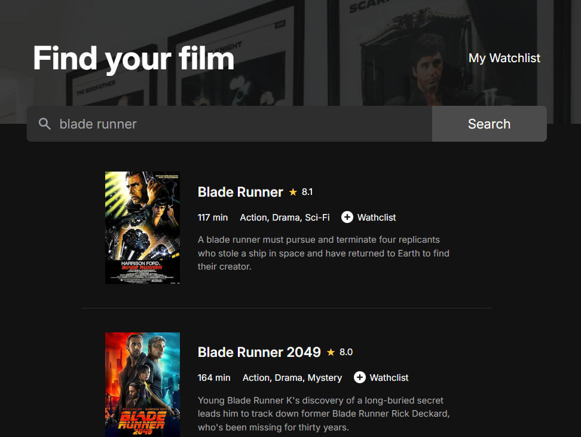
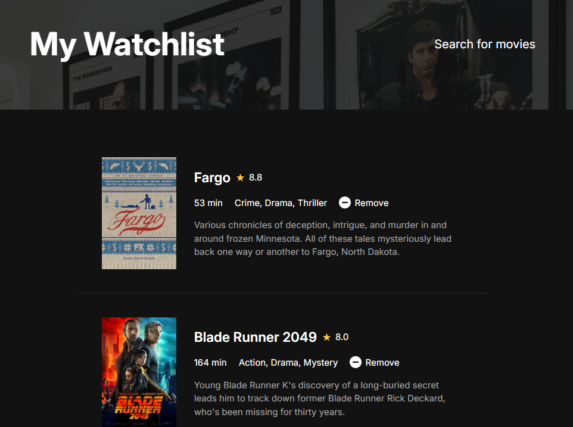

# 🎬 Movie Watchlist App

A responsive and minimal movie search and watchlist application built with **vanilla JavaScript**, **HTML**, and **CSS**. It uses the [OMDb API](https://www.omdbapi.com/) to fetch movie data and allows users to curate their own watchlist with local storage support.

---

## 📸 Preview

 <!-- Add your screenshot in the repo and update path -->

---

## ✨ Features

- 🔍 **Search Movies**: Type in a movie name and get instant results with poster, rating, runtime, and plot.
- ⭐ **Add to Watchlist**: Save your favorite movies to a personalized watchlist.
- 🗑 **Remove from Watchlist**: Manage your watchlist by removing movies anytime.
- 💾 **Persist Data**: Uses `localStorage` to keep your list saved across sessions.
- 📱 **Responsive Design**: Works well on desktop and mobile screens.

---

## 🚀 Tech Stack

- HTML5
- CSS3
- JavaScript (ES6+)
- OMDb API

---

## 🙋‍♂️ Connect with Me

Feel free to rip apart and rant about my lousy code at [Gulzar Shariff](https://www.linkedin.com/in/gulzarshariff/)
